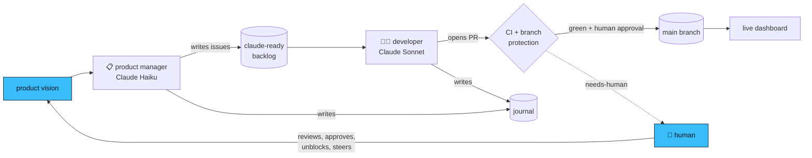

# 📊 Azure Pricing Radar

> The missing price history for Azure.

Microsoft publishes Azure retail prices, but not their **history**. When a
VM gets cheaper, a new SKU family appears, or Azure OpenAI token prices move
in one region and not another — that information exists for a moment, then
vanishes into the next price sheet.

**Azure Pricing Radar** records it. Every 6 hours, it checks the public
[Azure Retail Prices API](https://learn.microsoft.com/en-us/rest/api/cost-management/retail-prices/azure-retail-prices),
detects what changed — price drops, increases, new SKUs, regional rollouts —
and keeps the full history in this repository, visualized in a live
dashboard.

**🔗 Live dashboard:** https://andy-diericks.github.io/azure-pricing-radar/

<!-- screenshot of the dashboard here -->

## 📈 Dashboard features

The live dashboard is a static site (Vite + React) built from the data in this
repository — no backend, no tracking, no accounts.

**Biggest movers** — a hero strip at the top of the dashboard showing the most
dramatic price changes over the last 7 days and 30 days. Each time window lists
the top 3 biggest drops (green) and top 3 biggest increases (red), sorted by
percentage magnitude. Each entry shows the SKU name, region, percentage change,
and before → after price. Click any entry to jump to the full price-changes
feed below.

**SKU search** — a search box above the table for instant, case-insensitive
substring filtering by SKU name (e.g. typing `standard` narrows to all
`Standard_*` SKUs). The search term is preserved in the URL (`?search=…`) for
shareable filtered views. Works in combination with the facet filters below.

**Facet filters** — filter by service, region, direction, and minimum magnitude.
All active filters (search + facets) are encoded in the URL for sharing.

**Change-count summary** — a compact stats row above the table showing how
many changes of each type are in the current diff (e.g. _3 drops · 1 increase
· 12 new SKUs_), color-coded by direction. Zero-count categories are omitted.

**Price-changes table** — every detected price event from the latest data
fetch, showing:
- Direction badge: price drop, price increase, new SKU, or removed SKU
- SKU name and Azure region
- Before → after price with unit (e.g. `$/hour`)
- Percentage change (e.g. `-10.0%`, `+11.1%`)
- Click any row to open the per-SKU price history chart

**Per-SKU history chart** — a line chart of that SKU's price over time,
colored by direction (green for drops, red for increases, amber for new).
Click the back arrow or press Escape to return to the table.

**Data freshness badge** — the header shows when the data was last updated
(e.g. "Last updated: 17 Jul 2026, 16:02 UTC").

**Graceful states** — the table shows a skeleton while data loads, a plain-
language error message if the fetch fails, and an empty-state message when no
changes were detected.

**Mobile layout** — on small screens the table switches to a card list with
44 px touch targets and the same full data.

Prices are checked every 6 hours ([why not more often?](docs/adr/0003-fetch-cadence.md)) —
this is a radar for same-day detection, not a real-time ticker.

## 🔍 What it tracks today

- **Virtual Machines** — West Europe
- **Storage** — West Europe
- **Azure OpenAI** — EU regions

Scopes grow deliberately over time. Want one added? Open an issue.

## 💻 Run locally

```bash
git clone https://github.com/andy-diericks/azure-pricing-radar.git
cd azure-pricing-radar/app
npm install
npm run dev
```

The dev server proxies `data/` from the repository root, so you see real
historical data with no extra setup.

## 🤖 The twist: an AI builds this

This repository is autonomously maintained and developed by
[Claude Code](https://code.claude.com), running on GitHub Actions:

| Agent | Schedule | Job |
|---|---|---|
| 📥 Data pipeline | every 6h | Fetch scoped prices, diff against last snapshot, commit changes (deterministic, no AI) |
| 🧑‍💻 AI developer | every 4h | Pick exactly **one** `claude-ready` issue, implement it, open a PR, log it in the journal |
| 📋 AI product manager | daily | Triage issues and top up the backlog from the [product vision](docs/product-vision.md) |

Every run writes a diary entry — **read the
[development journal](journal.md)** to watch the project build itself,
decision by decision.

## 🧠 How the agents coordinate

This is a small **multi-agent system** — but not the kind where agents chat
with each other. The agents never communicate directly. They coordinate
entirely through shared artifacts in this repo: GitHub issues, pull requests,
and the journal.



Each run starts with **no memory** of previous runs. Everything an agent
needs, it reads from the repository — a constitution ([CLAUDE.md](CLAUDE.md)),
role playbooks, frozen architecture decisions ([ADRs](docs/adr/)), and the
journal. This is *stigmergic* coordination: like ants following trails rather
than holding meetings. The result is fully auditable (every decision is a
commit, an issue, or a journal entry), cheap to run, and resilient — a failed
run just leaves the next one a clean slate.

Guardrails keep it safe: agents work only from a labeled backlog, and every
pull request runs through CI on protected branches. Nothing reaches `main`
without **a human reviewing and approving it** — the developer opens PRs but
never merges its own work. When an agent is unsure, it stops and asks
(`needs-human`) rather than guessing. The human reviews pull requests,
answers those questions, and steers by editing the vision — the judgment the
agents structurally can't supply.


## ⚙️ How the data works

- `data/latest/` — current snapshot per scope
- `data/diffs/<date>/` — every detected change, timestamped: additions,
  removals, and price moves with before/after values

## 🤝 Contributing

The best contribution is a **well-written issue**: the AI developer works
from the backlog, so a clear Goal + Definition of done (see the "Claude
task" template) often becomes shipped code within hours. Human pull
requests are welcome too — CI treats everyone equally.

## 📜 License

MIT — data is sourced from Microsoft's public Retail Prices API.
